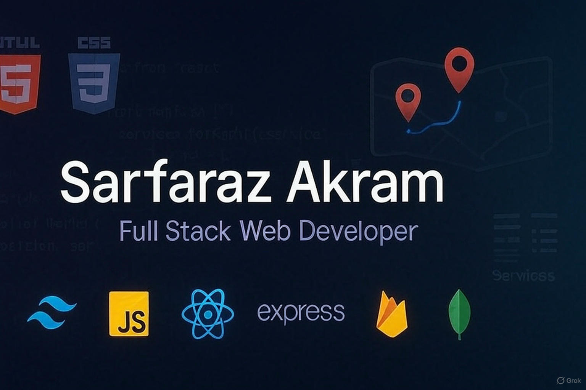

# 👨‍💻 Sarfaraz Akram
### Full Stack Web Developer

I specialize in building modern, responsive web applications using:

**HTML | CSS | Tailwind CSS | JavaScript | React | Express.js | Firebase | MongoDB**

## 💼 About Me

Hi there! I'm **Sarfaraz Akram** – a passionate Full Stack Web Developer from Bangladesh. I enjoy building clean and efficient web applications using modern technologies. When I'm not coding, I'm learning something new or experimenting with new stacks.

### 🔄 Current Activity:
🚚 I’m currently working on a door-to-door courier service website named ProFast
## Technologies i use when code

| Skills Overview          | Technologies |
|--------------------------|--------------|
| **Languages**            |  |
| **Frontend Technologies**|     |
| **Back-End Development** |   |
| **Database**             |  |
| **Tools & Platforms**    |     |

## Connect with me:

## GitHub Stats

  

